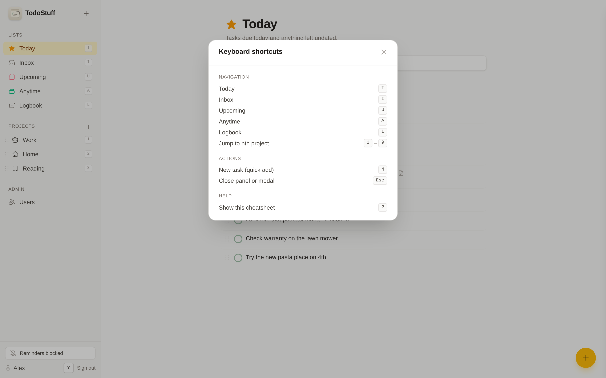
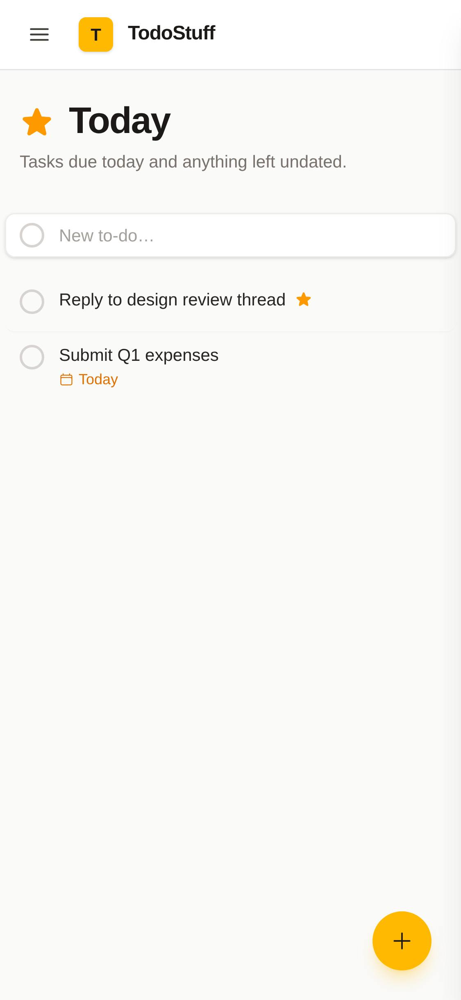
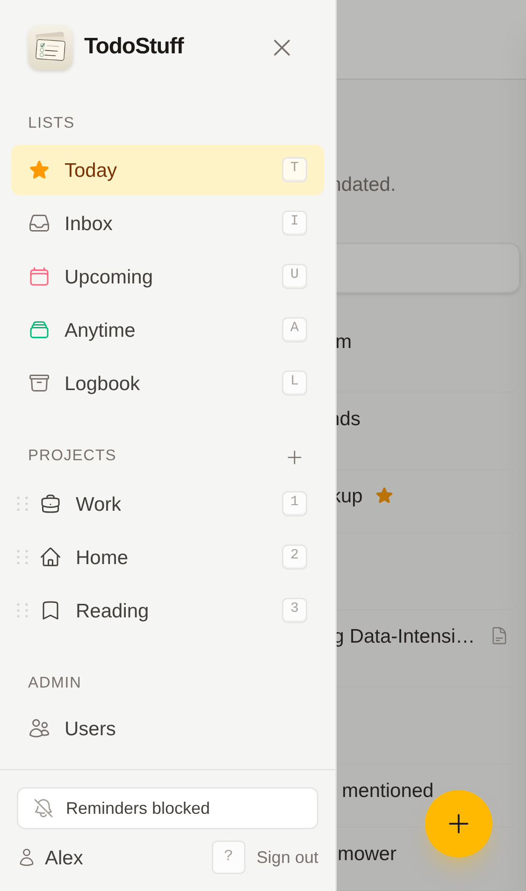

<p align="center">
  
</p>

# TodoStuff

A self-hosted Go to-do app with SQLite storage and a calm, responsive UI. Single binary, no JavaScript build step in the client (just HTMX), and your data stays on your machine.

The brand kit (icons, wordmarks, social card, palette) lives under [`brand/`](brand/) — see [`brand/BRAND.md`](brand/BRAND.md).


## Features

What's working today:

- **Smart lists** — Today, Inbox, Upcoming, Anytime, Logbook. Inbox is GTD-strict (no project *and* no due date) so it stays a clean triage queue. Upcoming groups by due date with smart labels ("Tomorrow", "Friday", "22 May").
- **Projects** with custom Heroicon icons and drag-to-reorder in the sidebar. Tasks moved out of a project go to the Inbox.
- **Due dates and times** with quick chips ("Today" / "Tomorrow" / "Next week" / "Clear") and overdue/today colour cues on the row.
- **Important flag** with a star indicator on the row.
- **Markdown notes** rendered with goldmark (GFM: tables, strikethrough, autolinks). Click-to-edit: rendered preview by default, source-edit textarea on click.
- **Recurring tasks** with two regeneration modes — *fixed schedule* (anchor on the previous due date, e.g. car insurance) and *after completion* (anchor on the completion timestamp, e.g. flu vaccine). On-create instances regenerate the moment the current one is completed.
- **Reminders** as a curated offset before the task's due datetime (5 / 10 / 15 / 30 minutes, 1 / 2 / 4 / 8 / 12 / 24 hours before, or "at the time"). Browser notifications fire via JS polling against a `/api/reminders/due` endpoint.
- **Pushover** — paste your Pushover user key under `/profile`, flip the toggle, and reminders ping your phone via [Pushover](https://pushover.net) the moment they're due. A server-side dispatcher delivers each reminder exactly once on its own channel, independent of the browser poller. There's a "Send test notification" button so you can verify the wiring without waiting for a real reminder.
- **Profile page** at `/profile` — edit your name, configure Pushover, and change your password. Email changes stay an admin operation.
- **Quick-add modal** reachable from the sidebar `+` button or a floating-action button on every page. "Fire and forget" capture: type a title, hit Enter, see a green check, keep typing.
- **Slide-over detail panel** — click any task to open it; edit title, project, dates, reminder, recurrence, importance, and notes inline. The list updates as you type.
- **Multi-user** with first-run admin onboarding (`/setup`), bcrypt password hashing, and HttpOnly + SameSite=Strict session cookies.
- **User administration** at `/admin/users` for admins — invite teammates, edit name / email / admin flag, reset passwords (revokes their sessions), or delete an account along with all of its data. Self-protection rails: you can't strip your own admin access or delete the only admin.
- **Single-binary deployment** — Go binary plus an embedded migrations FS and embedded HTML templates. Just point `DATABASE_PATH` at a writable directory.
- **Docker image** published to GHCR (`ghcr.io/andyjeffries/todo_stuff`) on every push to `master`, with a [`docker-compose.yml`](docker-compose.yml) for one-command self-hosting.
- **Responsive layout** — sidebar collapses to an off-canvas drawer on phones, with a hamburger-toggled top bar; tablet and desktop keep the sidebar in flow. Detail panel is full-screen on phones, modal-width on everything ≥sm. Tap targets bumped on mobile only (no visual change at desktop).
- **Drag-and-drop reordering** for tasks and projects, powered by [SortableJS](https://github.com/SortableJS/Sortable) (vendored). A subtle grip handle surfaces on row hover (always visible on touch); long-press to start a drag on phones, instant on desktop. The relative order *within* the dragged set persists; tasks elsewhere keep their positions.
- **Keyboard shortcuts** — `t` / `i` / `u` / `a` / `l` jump to Today / Inbox / Upcoming / Anytime / Logbook; `1`–`9` jump to the nth project; `n` opens quick-add from anywhere; `Enter` saves the focused form; `Esc` closes whatever overlay is open. Press `?` for the full cheatsheet — every sidebar row shows its key in a subtle right-aligned badge so the bindings are discoverable at a glance.

### Detail panel

Edit everything about a task in one place. Notes live as a clickable rendered preview by default; click to edit the markdown source, blur to swap back. Date/time chips set common values in one click. The Reminder section appears once both date and time are set.


### Project view

A project is just a smart list filtered down to one project. The per-row project tag is suppressed because it would be redundant.


### Upcoming

Future tasks grouped by due date with smart day labels.


### Quick add

Capture from anywhere — fire-and-forget, no view-context required.


### Keyboard shortcuts

Press `?` from any view to see every binding. The same keys are surfaced as subtle right-aligned badges on the sidebar rows, so navigation is discoverable without consulting the cheatsheet.



### Profile

Configure Pushover and change your password. The "Send test notification" button verifies the wiring without waiting for a real reminder; if the server isn't configured with a `PUSHOVER_APP_TOKEN` you'll see an inline notice on the page.


### Mobile

The sidebar slides in from the left when you tap the hamburger; tapping a list link or the backdrop closes it again. The detail panel takes the full screen on phones.

<p>
  
  
</p>

### Logbook

Completed tasks grouped by completion date. Click the checkmark again to restore.


## Roadmap

Next up:

- **Final polish** — error pages, loading states, empty states, favicon.

Further out: subtasks, project areas, tags, search, dark mode, iCal/CalDAV sync, PWA, sharing, attachments, email reminders, webhooks, and a fix for browser notifications on Safari/Chrome localhost (currently flaky).

## Quick start

### Docker (recommended)

```bash
git clone <this-repo> todostuff
cd todostuff
docker compose up -d
```

This pulls the prebuilt image from `ghcr.io/andyjeffries/todo_stuff:latest` (no local build needed), mounts a named volume at `/data` for the SQLite file, and exposes the app on `http://localhost:8636`. The first request redirects you to `/setup` to create the admin user. Defaults work for a localhost install; copy `.env.example` to `.env` if you want to set `PUSHOVER_APP_TOKEN`, `TZ`, or `COOKIE_SECURE`. Swap `image:` for `build: .` in `docker-compose.yml` if you'd rather build from source.

> **Why 8636?** That's "TODO" on a T9 phone keypad (T=8, O=6, D=3, O=6). It's IANA-unassigned and doesn't clash with any of the usual self-host suspects (Jellyfin 8096, Home Assistant 8123, Sonarr 8989, Vikunja 3456, Bitwarden 8080…), so it should Just Work alongside whatever else you're running.

### From source

```bash
git clone <this-repo> todostuff
cd todostuff
make css       # builds Tailwind once
go run ./cmd/todostuff
```

Then open `http://localhost:8636`. The first request creates the SQLite DB at `./data/todostuff.db` and redirects you to `/setup` to create the admin user.

### Configuration

| Variable | Default | Notes |
|---|---|---|
| `DATABASE_PATH` | `./data/todostuff.db` | SQLite file. Parent directory is created on boot. |
| `PORT` | `8636` | HTTP listen port. "TODO" on a T9 keypad — IANA-unassigned and clear of common self-host defaults. |
| `COOKIE_SECURE` | `false` | Set to `true` behind HTTPS in production. |
| `TZ` | system default | Timezone for due-date / due-time / reminder calculations. The browser posts `<input type="date">` / `time` values without a timezone; the server interprets them in `TZ`. |
| `PUSHOVER_APP_TOKEN` | unset | Optional. Application token from your [Pushover](https://pushover.net) account. When set, the server runs a 60-second-tick dispatcher that delivers due reminders to users who've enabled Pushover in `/profile`. Unset = feature disabled, no dispatcher overhead. |

### Make targets

| Target | What it does |
|---|---|
| `make build` | Build the binary into `./bin/todostuff`. |
| `make run` | Build then run on `:8636`. |
| `make dev` | Run with verbose logging. |
| `make css` | One-shot Tailwind v4 build into `web/static/css/app.css`. |
| `make css-watch` | Watch mode for Tailwind during development. |
| `make tidy` | `go mod tidy`. |

## Tech stack

- **Backend:** Go (stdlib + [chi](https://github.com/go-chi/chi)).
- **Storage:** SQLite via [`mattn/go-sqlite3`](https://github.com/mattn/go-sqlite3) (CGO), WAL mode, foreign keys on, embedded migrations.
- **Auth:** bcrypt (cost 12) + 32-byte session tokens, HttpOnly + SameSite=Strict cookies, 30-day expiry.
- **Templates:** Go `html/template`, embedded via `embed.FS`. Layouts + partials parsed alongside each page.
- **Frontend:** Server-rendered HTML + [HTMX 2](https://htmx.org/) (vendored), with [SortableJS](https://github.com/SortableJS/Sortable) for drag-and-drop. No framework, no build step on the client.
- **Styling:** [Tailwind CSS v4](https://tailwindcss.com/), driven by `@tailwindcss/cli`.
- **Icons:** [Heroicons v2](https://heroicons.com/) inlined as templated SVGs.
- **Markdown:** [goldmark](https://github.com/yuin/goldmark) with the GFM extension. Rendered HTML is stored alongside the source on save.

## Project layout

```
cmd/todostuff/         Entry point.
internal/
  auth/                Sessions, password hashing, request-context helpers.
  database/            Open + Migrate.
  handlers/            HTTP handlers.
  middleware/          RequireAuth, RequireAdmin, AllowHead.
  models/              Pure structs that mirror DB rows.
  notifications/       Outbound channels (Pushover today).
  render/              Template loader + funcs.
  services/            Business logic (Tasks, Projects, recurrence, reminders).
migrations/            Numbered SQL files, applied lexicographically once.
web/
  static/              Compiled CSS + vendored HTMX + app.js.
  templates/           layouts/, pages/, partials/.
docs/screenshots/      README screenshots.
LICENSE.md             GNU GPL v3.
```

## License

GNU General Public License v3 or later — see [LICENSE.md](LICENSE.md).
